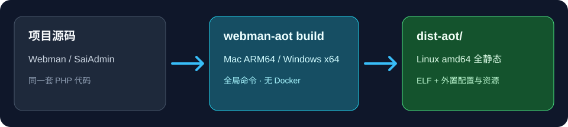

# Webman AOT

在 macOS 或 Windows 开发机上，把 Webman / SaiAdmin 项目编译成可部署到
Linux amd64 的全静态程序。目标项目不用安装 AOT Composer 插件，构建时不用 Docker。

**这个仓库存放的是 Webman AOT 编译工具的源码，不是要装进 Webman 项目的插件。**
只想使用工具，直接从 [Releases](https://github.com/supdger/webman-aot/releases/tag/v0.1.2)
下载安装包；想自行制作安装包，可按[源码构包说明](docs/build-installers.md)
操作：Windows 有自动准备锁定输入、构包及临时安装自检的命令，Mac 仍须
备齐锁定的运行时。
源码 ZIP 本身不是可安装的工具包。

> 当前 `fix/doctor-progress-autoprepare` 分支尚未发布安装包。下面的
> `doctor` 自动准备行为只适用于用本分支源码构建的新包；下载上方
> v0.1.2 发布包的用户仍需按
> [v0.1.2 安装与构建说明](https://github.com/supdger/webman-aot/blob/v0.1.2/docs/install-and-build.md)
> 执行一次 `webman-aot doctor --repair`。不要把分支源码当成已发布的新版本。

**工具在同一台开发电脑上只需安装一次。** 以后编译另一个项目，或修改项目
后重新编译，都不用重新安装工具，也不用在项目里 `composer require`；
进入对应项目目录，重复[第 2 步](#第-2-步编译你的项目)的编译与校验命令即可。



图里的“项目源码”指**你自己的 Webman / SaiAdmin 后端项目**，不是本仓库的
源码 ZIP。使用 `webman-aot build` 前，必须先在开发电脑安装好工具。

它会自动发现项目及已安装插件的业务 PHP、在隔离目录生成必要的 AOT 适配，
并在发布前检查漏编译与包完整性。普通 PHP 源码保持不变；目标服务器不需要
安装 PHP 或 Docker。

## 第 1 步：下载并安装工具

到 [v0.1.2 安装包页面](https://github.com/supdger/webman-aot/releases/tag/v0.1.2)
的 **Assets** 下载一个与你的**开发电脑**匹配的文件：

- macOS Apple Silicon：`webman-aot-0.1.2-macos-arm64.tar.gz`
- Windows x64：`webman-aot-0.1.2-windows-x86_64.zip`

普通用户**只下载上面二选一的安装包**。`macos-php-relink-materials.tar.gz`
是修改和重链接 PHP 运行时的源码材料，不是第三个平台的安装包；
`SHA256SUMS.txt` 是可选的独立复核材料，也不用下载才能安装。

正常安装**不要求你手工计算 SHA-256**：安装脚本会自动校验包内每个文件，
不匹配就停止。发布者也应在上传前核对安装包摘要；`SHA256SUMS.txt`
保留给想独立复核的用户。不要下载 GitHub 自动生成的「Source code (zip)」来代替安装包；
它是供阅读、修改及[自行构包](docs/build-installers.md)的工具源码。

从头到尾是这条关系：

```text
本仓库源码 + 锁定的第三方运行时 → Mac/Windows 工具安装包
工具安装包 → 在开发电脑安装 webman-aot 命令
webman-aot 命令 + 你的 Webman 项目 → Linux dist-aot/ 发布目录
```

## 这三个东西分别是什么

1. GitHub「Code → Download ZIP」下载的是**Webman AOT 工具的源代码**：给开发者查看和修改，**不是安装包，解压后不能直接使用工具**。
2. `webman-aot-...-macos-arm64.tar.gz` 或 `webman-aot-...-windows-x86_64.zip` 是**编译工具安装包，不是 Webman 插件包**：按你的开发电脑系统选一个，在同一台电脑上只安装一次。本文下面的安装命令用的是这个文件。
3. `dist-aot/` 是**编译结果**：安装工具后，在你的 Webman 项目里运行 `webman-aot build` 才会生成；它要复制到 Linux 服务器运行。

看**开发电脑**的系统选择安装包，不是看 Linux 服务器的系统。Mac 和
Windows 安装包最终都编译出 Linux amd64 程序；Windows 包不会生成 Windows exe。
**每个平台只选一种情况做一次：**如果还只有 ZIP/tar.gz，先解压再运行
安装脚本；如果已经解压，直接运行解压文件夹里的脚本，不要再解压。
当前 v0.1.2 没有双击安装入口。两个方法的逐步说明见
[安装说明](docs/install-and-build.md#第-1-步在开发电脑安装工具)。

- **Windows：**右键下载的 ZIP，选“全部提取”。打开解压出的文件夹，确认
  能看到 `install.ps1`。在该文件夹的地址栏输入 `powershell` 并按回车，
  然后执行：

  ```powershell
  powershell -ExecutionPolicy Bypass -File .\install.ps1
  ```

- **Mac：**双击下载的 tar.gz 解压，进入能看到 `install.sh` 的文件夹，
  在该文件夹打开终端，然后执行：

  ```sh
  ./install.sh
  ```

安装脚本结束时会显示 `Webman AOT installed in:` 和
`Command installed as:` 两行。**这表示安装脚本已完成**；接着关闭并
重新打开终端，运行：

```sh
webman-aot version
```

看到 `webman-aot 0.1.2`，才表示**命令也能正常使用、工具安装验证通过**。
此时还没有编译任何项目，也没有生成 `dist-aot/`。安装器只写入当前
用户目录，不安装系统级 PHP。
安装包摘要和补充说明见[安装说明](docs/install-and-build.md)。

## 第 2 步：编译你的项目

在开发电脑上，进入**你自己的 Webman 后端目录**，即同时能看到
`webman` 和 `composer.json` 的目录；**不是刚解压的安装包目录，
也不是本工具的源码目录**。

检查环境并自动准备缺少的编译组件。安装成功不等于组件已经准备好：

```sh
webman-aot doctor
```

首次使用时，`doctor` 会在平台、磁盘、锁文件和项目检查通过后自动下载、
校验并准备缺少的组件，可能较久；不必再手动输入 `doctor --repair`。
只有最后看到 `Result: healthy` 才能继续编译。若出现 `unhealthy`，
按具体 `[ERROR]` 和诊断文件排查，不要直接执行 `build`。
只想检查且不下载时用 `webman-aot doctor --check`。健康后编译并检查产物：

```sh
webman-aot build --profile=saiadmin
webman-aot verify
```

普通 Webman 项目把编译命令改为 `webman-aot build`；SaiAdmin 也可以自动识别。
未知插件代码或依赖结构不兼容时会报错，不会静默跳过业务 PHP。
成功后，**当前 Webman 项目目录**下才会出现 `dist-aot/`。
下次编译同一项目或其他项目时，无需重做第 1 步；进入该项目目录，
执行 `webman-aot build --profile=saiadmin` 和 `webman-aot verify` 即可。
普通 Webman 项目仍省略 `--profile=saiadmin`。

已实际验证的组合是 SaiAdmin 6.1.5、Webman 2.2.4、TypePHP 0.9.2 和锁定的
PHP 8.4 工具链；其他依赖版本和插件需要重新验证。SaiAdmin 的普通 PHP 8.4
注意事项见[兼容与迁移](docs/saiadmin-compatibility.md)。

## 第 3 步：部署到 Linux

把**整个** `dist-aot/` 目录复制到 Linux amd64 服务器。在部署目录配置外置
`.env`（数据库等环境配置不用重新编译），然后从该目录启动：

```sh
cd dist-aot
./start.sh
```

后台运行可用 `./start.sh --daemon`；停机用 `./stop.sh`。不要只复制 ELF、
不要把开发机的私有 `.env` 或历史上传/导出数据打进发布包。上线前按
[Linux 验收步骤](docs/linux-acceptance.md)检查静态链接、启动和业务接口。
目标机不需要 PHP 或 Docker；“全静态”不等于所有未测试系统都已通过业务验收。

## 卸载开发电脑上的工具

卸载脚本在**安装时解压出的安装包文件夹**，不在 Webman 项目目录里。
打开那个能直接看到 `uninstall.ps1` 或 `uninstall.sh` 的文件夹，并在
该文件夹打开终端。先确认脚本存在，再运行：

```sh
# macOS
ls ./uninstall.sh
./uninstall.sh --purge
```

```powershell
# Windows PowerShell
Test-Path -LiteralPath .\uninstall.ps1  # 应显示 True
powershell -ExecutionPolicy Bypass -File .\uninstall.ps1 -Purge
```

`--purge` / `-Purge` 会一并清除工具下载的编译组件和安装备份；不加则保留
部分缓存与备份。卸载不会删除 Webman 项目或项目里的 `dist-aot/`。
如果检查结果是 `False`，说明当前目录不是安装包解压目录，**不要继续
执行卸载命令**；先找到实际解压目录。解压目录已删除时，可从上面的
Release 重新下载对应安装包并解压。细节见
[安装与卸载说明](docs/install-and-build.md#卸载开发电脑上的工具)。

## 验证记录

[查看编译、跨 Mac/Windows 一致性及 Linux 运行证据](docs/verification.md)。
这些记录可在 GitHub 上单独查看，不包含在 `main` 的源码下载 ZIP 中。
问题反馈请使用 [Issues](https://github.com/supdger/webman-aot/issues)。

本项目原创代码使用 [MIT 许可证](LICENSE)；TypePHP 补丁及第三方组件保留
各自许可，详见[归属说明](NOTICE.md)。
