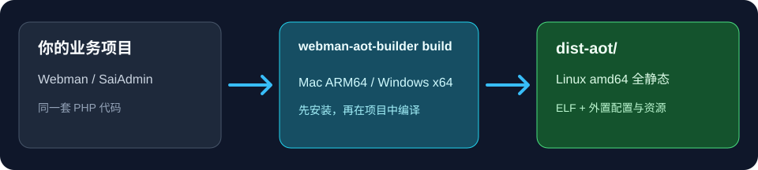

# Webman AOT Builder

在 macOS 或 Windows 开发机上，把 Webman / SaiAdmin 项目编译成可部署到
Linux amd64 的全静态程序。目标项目不用安装 AOT Composer 插件，构建时不用 Docker。

**产品名：Webman AOT Builder（`webman-aot-builder`）。** 这是编译工具，不是
要安装进 Webman 项目的插件。目标仓库为
[supdger/webman-aot-builder](https://github.com/supdger/webman-aot-builder)，
本次改名版本为 v0.2.0。v0.2.0 是否已发布及其当前资产，以
[v0.2.0 Release 页面](https://github.com/supdger/webman-aot-builder/releases/tag/v0.2.0)
为准。

目前已发布的 v0.1.3 仍是旧名称资产：包名以 `webman-aot-0.1.3-` 开头，
命令为 `webman-aot`，用户数据目录也使用旧根。可在
[旧版 v0.1.3 Release](https://github.com/supdger/webman-aot/releases/tag/v0.1.3)
查看这些历史安装包。新版本发布后，请从新仓库的 Release 选择对应开发电脑平台
的 `webman-aot-builder` 安装包；旧版 `self-update` 只更新旧应用载荷，不会
完成命令、安装目录或缓存迁移。

## 新版本安装与使用

v0.2.0 发布后，从 `supdger/webman-aot-builder` 的 Release 下载与你的**开发电脑**
匹配的 macOS Apple Silicon 或 Windows x64 安装包。同一平台有轻量包和完整包：
轻量包首次使用会联网取得并校验编译组件，完整包内含相同组件，可离线准备。
安装器会使用新版专属用户目录：

- macOS：`~/Library/Application Support/webman-aot-builder`
- Windows：`%LOCALAPPDATA%\webman-aot-builder`
- 自定义用户目录：设置 `WEBMAN_AOT_BUILDER_HOME`

安装新版后，在你的 Webman 项目目录（同时包含 `webman` 和 `composer.json`）运行：

```sh
webman-aot-builder version
webman-aot-builder doctor
webman-aot-builder build --profile=saiadmin
webman-aot-builder verify
```

普通 Webman 项目运行 `webman-aot-builder build`，可省略
`--profile=saiadmin`。`doctor` 检查环境并按需准备轻量包的编译组件；
只有看到 `Result: healthy` 才继续构建。成功后，项目目录会出现 `dist-aot/`，
这是要部署到 Linux amd64 的发布目录。`verify` 检查产物结构，不代替目标机的
启动、数据库和业务接口验收。

旧版与新版并存时，新版安装和卸载仅管理 `webman-aot-builder` 命令及新版目录；
不会读取、覆盖或删除旧版用户数据。新版不会自动搬运旧缓存。确认新版工作后，
如需移除 v0.1.3，请使用旧版安装包内的卸载脚本，并先确认是否要保留旧版数据。

## 从源码构建安装包

本仓库源码用于制作 macOS 和 Windows 开发机上的工具安装包；源码 ZIP 本身不是
可安装的工具。源码与仓库当前状态见
[目标仓库](https://github.com/supdger/webman-aot-builder)。相关步骤见
[从源码制作安装包](docs/build-installers.md)。Windows 可运行脚本准备锁定输入、
构包和临时安装自检；macOS 还需准备锁定的运行时输入。

## 构建关系

```text
Webman AOT Builder 源码 + 锁定的第三方运行时 → macOS/Windows 工具安装包
工具安装包 → 在开发电脑安装 webman-aot-builder 命令
webman-aot-builder + 你的 Webman 项目 → Linux dist-aot/ 发布目录
```



图里的“项目源码”指你自己的 Webman / SaiAdmin 后端项目，不是本仓库源码。
安装包按开发电脑系统选择，不是按目标 Linux 服务器选择；Windows 安装包也生成
Linux amd64 程序，不生成 Windows exe。

## 验证与兼容范围

当前记录的验证组合为 SaiAdmin 6.1.5、Webman 2.2.4、TypePHP 0.9.2 与锁定的
PHP 8.4 静态 SDK。阅读[验证记录](docs/verification.md)、
[SaiAdmin 兼容与迁移](docs/saiadmin-compatibility.md)及
[Linux 目标机验收](docs/linux-acceptance.md)，区分已有证据和仍需在目标环境
完成的验收。v0.2.0 的候选改动和验证边界见
[v0.2.0 发布说明与验证边界](docs/releases/v0.2.0.md)。

本项目原创代码使用 [MIT 许可证](LICENSE)；TypePHP 补丁及第三方组件保留
各自许可，详见[归属说明](NOTICE.md)。问题反馈入口为目标仓库的
[Issues](https://github.com/supdger/webman-aot-builder/issues)。
