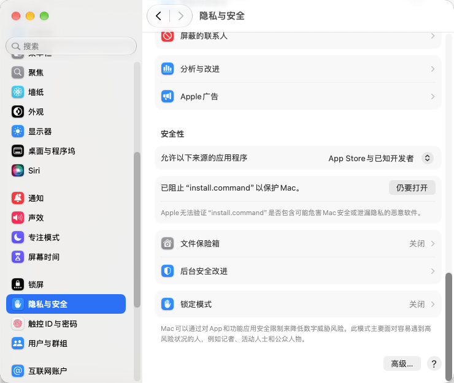
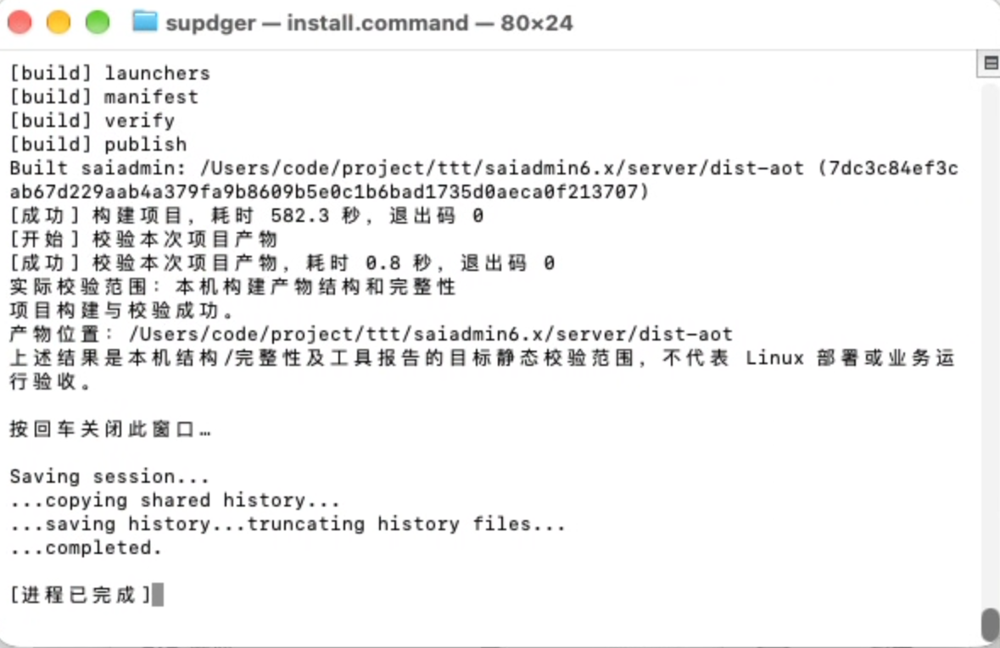
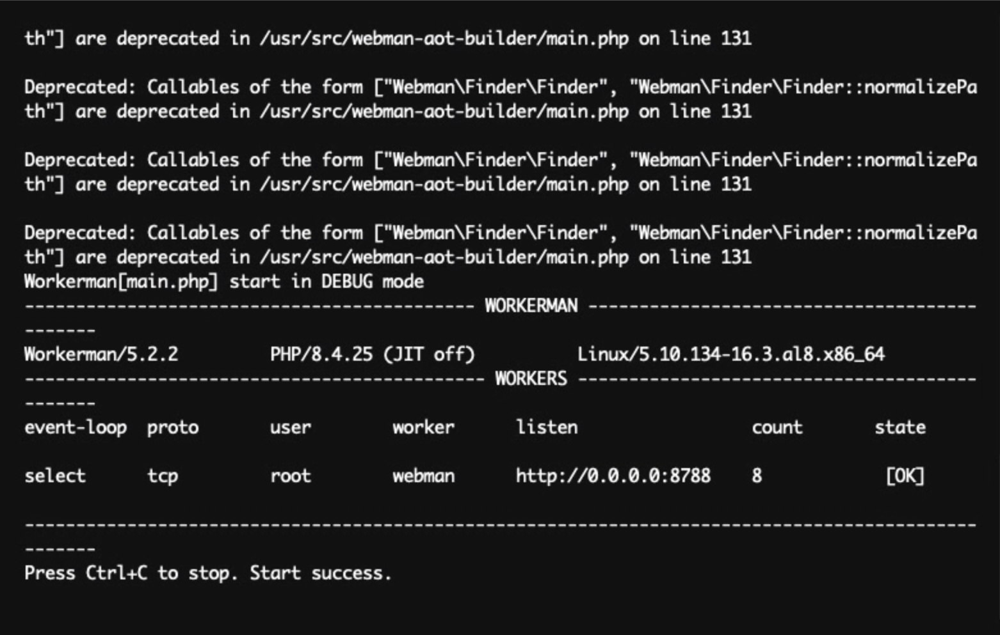
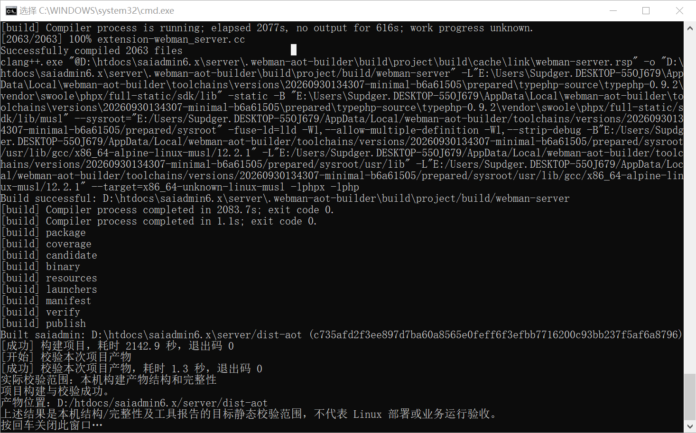
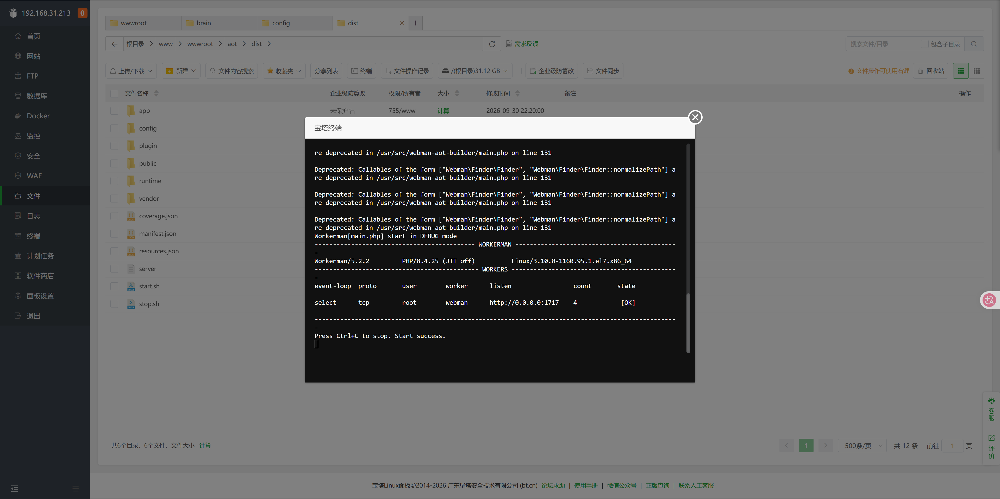

# Webman AOT Builder

Webman AOT Builder 将 Webman / SaiAdmin 项目编译成 Linux amd64 全静态程序。
在 macOS Apple Silicon 或 Windows x64 开发机上安装工具、构建项目，再将生成的 `dist-aot/` 部署到 Linux，目标机无需安装 PHP。

当前处于开发阶段，公开包可用于开发验证，完整安装、项目构建及 Linux 业务流程尚未验收通过。
已有检查及其适用范围见 [测试与验证范围](https://github.com/supdger/webman-aot-builder/wiki/Verification)。

## 实现方式

构建器在项目副本中做兼容适配，通过 TypePHP 编译 PHP 代码，再用 Clang 和 PHPx 静态 SDK 生成可执行程序。
原项目源码保持不变，配置、模板和静态资源按需保留为外置文件。


## 源码与安装包

本仓库是构建工具的源码，包含命令行程序、项目适配、编译组件管理和安装包制作脚本。
开发或自行制作安装包可从 [最新开发源码](https://github.com/supdger/webman-aot-builder/tree/main) 开始，
具体步骤见 [源码构建指南](https://github.com/supdger/webman-aot-builder/wiki/Build-from-source)。

Composer 安装入口的源码也在本仓库，包名为 `saiadmin/webman-aot-builder`。Composer 入口与仓库标签共用 **0.3.3**，使用固定的 0.3.2 完整运行时；可安装版本以 [Packagist 包页面](https://packagist.org/packages/saiadmin/webman-aot-builder)为准。在已安装系统 PHP 8.1+ 与 Composer 的开发机运行：

```sh
composer global require saiadmin/webman-aot-builder:^0.3.3
composer global config bin-dir --absolute
```

将输出的命令目录放到旧版 `webman-aot` 所在目录之前，或使用此目录下代理的完整路径。`webman-aot --version` 应显示入口 0.3.3、目标构建器 0.3.2。第一次 `webman-aot build` 会准备经校验的既有 0.3.2 完整运行时；进入含 `composer.json`、`composer.lock` 和 `start.php` 的项目目录后执行。网络失败可导入对应完整安装包。Composer 只安装轻量入口 ZIP，源码回退时会取得整个仓库；原有安装不会被覆盖。入口的 PHP 8.1 与 Windows 真机验收仍未完成。受影响用法见[安装与使用指南](https://github.com/supdger/webman-aot-builder/wiki/Install)。

0.3.3 是仓库标签与 Composer 入口版本，已验收完整运行时仍为 0.3.2。本次补充 Release 只提供 Composer 入口，发布时不设为 `latest`；下述 setup 和完整资源仍由原完整发行入口提供。

第一次安装，请打开 [最新发布包下载页](https://github.com/supdger/webman-aot-builder/releases/latest)，下载与你的**开发机**匹配的 **setup**。文件名包含发布版本，按下面的**后缀**选择：

| 开发机 | 首次安装推荐下载 | 启动方式 |
| --- | --- | --- |
| macOS Apple Silicon | 文件名以 `macos-arm64-setup.zip` 结尾的 ZIP | 解压后运行其中的 `.command` |
| Windows x64 | 文件名以 `windows-x86_64-setup.cmd` 结尾的 CMD | 运行该 `.cmd` |

setup 会让你选择轻量包或完整包，再自动下载、校验和安装；下载时需要联网。

- **轻量包**：安装包较小，首次构建时联网下载编译组件。
- **完整包**：包含编译组件，可提前下载后复制到离线开发机；自己的项目仍须事先备好 Composer 依赖及构建所需文件。

两种包安装后都提供 `webman-aot` 命令。需要手动下载或离线安装时，具体资产及校验清单以 [最新 Release](https://github.com/supdger/webman-aot-builder/releases/latest) 为准，步骤见 [安装与使用指南](https://github.com/supdger/webman-aot-builder/wiki/Install)。编译组件包不能独立安装工具，GitHub 的 `Source code` 是源码；首次安装请选择 setup。
这些下载包安装在开发机上；Linux 目标机接收构建生成的整个 `dist-aot/`。

### macOS 首次打开被拦截时

首次双击 `setup.command` 或 `install.command`，可能看到“未打开”或“Apple 无法验证”提示。先确认文件来自本项目 [正式发行页](https://github.com/supdger/webman-aot-builder/releases/latest)，并用同一版本的 `SHA256SUMS` 核对下载文件，然后按以下步骤操作：

1. 在提示窗口点 **“完成”**，保留文件，不要点“移到废纸篓”。

   

2. 打开苹果菜单 → **系统设置 → 隐私与安全性**，向下滚动到 **“安全性”**。
3. 找到“已阻止 `install.command`（或 `setup.command`）”的提示，确认文件名后点 **“仍要打开”**。

   

4. 按系统提示再次确认“打开”或“仍要打开”，并完成登录密码或 Touch ID 验证。若终端未自动出现，回到解压目录，再双击同一个 `.command`。
5. 终端打开后，按安装器提示继续。

若找不到“仍要打开”，重新双击一次文件，再回到该设置页面；该按钮通常只在尝试打开后约一小时内显示。详见 [Apple 官方说明](https://support.apple.com/zh-cn/102445)。以上步骤适用于“无法验证”提示；若提示“将损坏你的电脑”或“文件已损坏”，请停止安装，重新下载并核对校验值。

## 开始使用

无论选择轻量包还是完整包，都须先按目标项目自身的安装要求完成 Composer 依赖安装（包括 `vendor/`）。
选择项目目录时，请使用包含 `composer.json`、`composer.lock`、`start.php` 和 `app/` 的 Webman / SaiAdmin 后端根目录。

准备好项目后，按以下步骤完成安装和首次构建：

1. 在 [最新发布包下载页](https://github.com/supdger/webman-aot-builder/releases/latest) 下载上表中对应开发机的 **setup** 并启动。
2. 按提示选择轻量包或完整包，确认安装位置及 PATH 影响；工具会下载、校验、安装并核对安装版本。
3. 选择“构建项目”，输入自己的 Webman / SaiAdmin 后端根目录。
4. 等待构建及自动校验完成。成功时会显示产物位置，项目目录中会生成 `dist-aot/`，下一步见 [构建结果](#构建结果)。

从源码开始时，macOS 在源码根目录执行 `sh ./build.command`，Windows 在 PowerShell 执行 `.\build.cmd`。入口会自动准备锁定材料、制作安装包并检查包清单，随后进入相同的安装和项目流程。具体启动步骤见 [源码构建指南](https://github.com/supdger/webman-aot-builder/wiki/Build-from-source)。

过程会显示当前步骤、实际下载状态和编译器输出的文件计数。较长步骤没有新输出时，会显示进程状态、已用时间和无输出时长；沉默期间的工作进度会标为未知。成功时告诉你产物位置和下一步；失败时保留原始原因，提供恢复建议、本机日志位置和 [Issues](https://github.com/supdger/webman-aot-builder/issues) 地址。项目构建失败后可选择重试、重选目录或结束。

发布状态以 Release 中实际提供的资产为准；源码候选不等于已公开的安装包。开发状态及已有记录见 [开发状态与历史记录](https://github.com/supdger/webman-aot-builder/wiki/History)。

自动 `verify` 检查构建产物的结构、完整性及工具报告的静态属性；Linux 目标机启动、数据库和业务接口仍需部署后验收。

## v0.3.2 兼容范围

v0.3.2 适配锁定的 Carbon 3.14.1 与 `symfony/polyfill-deepclone` 1.42.0，并使用本项目重建的 PHPX 静态 SDK 支持其所需的闭包绑定和引用存储。适配只作用于隔离构建副本，版本或源码摘要不匹配时拒绝应用；`Closure::call()` 仍不支持。适用组合与限制见 [SaiAdmin 兼容说明](https://github.com/supdger/webman-aot-builder/wiki/SaiAdmin-Compatibility)。

普通安装继续选择 setup。维护者的 `webman-aot-builder-0.3.2-derived-linux-x86_64-sdk.tar.xz` 是 Linux x86_64 musl 目标 SDK 素材，不是开发机安装包或 PHPX 官方发行资产；来源与重建步骤见 [源码构建指南](https://github.com/supdger/webman-aot-builder/wiki/Build-from-source)。

## 安装后的命令行使用

引导入口会自动执行校验。需要以后单独构建其他项目时，可在已安装的终端中使用 `webman-aot`；命令和启动示例见 [安装与使用指南](https://github.com/supdger/webman-aot-builder/wiki/Install)。SaiAdmin 的适用版本及要求见 [SaiAdmin 兼容说明](https://github.com/supdger/webman-aot-builder/wiki/SaiAdmin-Compatibility)。

## 构建结果

产物结构示意（运行资源随项目而异）：

```text
dist-aot/
├── server          # Linux amd64 全静态程序
├── start.sh        # 启动脚本
├── stop.sh         # 停止脚本
├── config/         # 外置配置
├── …               # 项目所需的模板、静态资源等
└── manifest.json   # 分发清单
```

把**整个 `dist-aot/`** 复制到 Linux amd64 目标机，按项目需要配置 `.env`、数据库等运行环境后，
在该目录启动：

```sh
./start.sh
```

后台运行用 `./start.sh --daemon`，停止用 `./stop.sh`。
目标机配置和启动后的业务检查见 [Linux 部署与验收](https://github.com/supdger/webman-aot-builder/wiki/Linux-Acceptance)。

## 实机构建与启动验证

2026-09-30，用户在 macOS Apple Silicon 和 Windows x64 实机构建 SaiAdmin 项目，并分别将产物复制到 Linux x86_64 服务器启动。以下为用户提供的终端关键输出摘录；macOS 和 Windows 是构建宿主，生成的程序面向 Linux。

### macOS Apple Silicon：构建并在 Linux 启动

使用 v0.3.2 轻量包安装并准备编译组件，构建 SaiAdmin 项目。以下保留安装、组件准备、编译及产物校验的关键节点，省略重复进度行：

```text
Package contents SHA-256 verified.
[成功] 校验包并安装，耗时 0.8 秒，退出码 0
webman-aot 0.3.2
[prepare] Extracted 7614/7614 verified entries
[prepare] Minimal component SHA-256 verification complete
[prepare] Minimal toolchain activated and ready.
[2063/2063] 100% extension-webman_server.cc
Successfully compiled 2063 files
[build] Compiler process completed in 529.8s; exit code 0.
[成功] 构建项目，耗时 582.3 秒，退出码 0
[成功] 校验本次项目产物，耗时 0.8 秒，退出码 0
项目构建与校验成功。
```



将这次 Mac 构建的产物复制到 Alibaba Cloud 3 (Soaring Falcon) x86_64 服务器，在产物目录执行 `./start.sh`，报告 8 个 worker 启动成功（文字日志中的进程用户名已脱敏）。用户提供的服务器环境标注为 `x86_64 (Py3.7.16)`；`Py3.7.16` 是服务器环境信息，程序的 PHP 版本见下方启动日志：

```text
Workerman[main.php] start in DEBUG mode
Workerman/5.2.2         PHP/8.4.25 (JIT off)          Linux/5.10.134-16.3.al8.x86_64
event-loop  proto       user        worker      listen                 count       state
select      tcp         <用户>      webman      http://0.0.0.0:8788    8            [OK]
Press Ctrl+C to stop. Start success.
```



### Windows x64：构建并在 CentOS 7 启动

使用 v0.3.2 Windows 完整包构建 SaiAdmin 项目。现有日志保留了编译尾段、构建完成和产物校验，构建总耗时约 35 分 43 秒：

```text
[1920/2063] 94% vendor\symfony\console\Formatter\OutputFormatterStyleStack.cc
[2063/2063] 100% extension-webman_server.cc
Successfully compiled 2063 files
[build] Compiler process completed in 2083.7s; exit code 0.
[成功] 构建项目，耗时 2142.9 秒，退出码 0
[成功] 校验本次项目产物，耗时 1.3 秒，退出码 0
实际校验范围：本机构建产物结构和完整性
项目构建与校验成功。
```



将这次 Windows 构建的产物复制到另一台 CentOS 7 服务器，在产物目录执行 `./start.sh`，报告 4 个 worker 启动成功（文字日志中的进程用户名已脱敏）：

```text
Workerman[main.php] start in DEBUG mode
Workerman/5.2.2         PHP/8.4.25 (JIT off)          Linux/3.10.0-1160.95.1.el7.x86_64
event-loop  proto       user        worker      listen                 count       state
select      tcp         <用户>      webman      http://0.0.0.0:1717    4            [OK]
Press Ctrl+C to stop. Start success.
```



两台开发机的构建与产物校验均成功，两个 Linux 目标环境均报告服务启动成功；Mac 安装过程另有成功记录。启动仍有兼容性告警，HTTP、数据库和业务接口尚未验收。详细过程见 [实机测试记录](https://github.com/supdger/webman-aot-builder/wiki/Build-from-source#v032-实机测试记录)。

## 文档

- [Wiki](https://github.com/supdger/webman-aot-builder/wiki/Home)：安装、使用与维护文档
- [更新日志](https://github.com/supdger/webman-aot-builder/blob/main/CHANGELOG.md)：功能、修复与升级影响

## 许可与反馈

原创代码采用 [MIT 许可证](LICENSE)，第三方组件的许可与归属见 [NOTICE](NOTICE.md)。
问题与建议请提交到 [Issues](https://github.com/supdger/webman-aot-builder/issues)。
